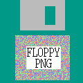

# Introduction

<div id="logo"></div>

A Floppy PNG stores data and programs inside a PNG, and provides visual descriptions on the label.  It has several features to assure integrity.  This website archives published Floppy PNG RSA-PSS signatures for verification, as it is dangerous to run code mixed with data, or, for that matter, any code you find on the World Wide Web.


## Design

The idea of the Floppy PNG comes from building a [model of a small town of 5,000](https://triples.pub) people facing the crisis of a regional network outage.  I realized that the entire model, including reporting, names, addresses, and diagrams, would fit on something the size of a 1.44MB floppy disk from 1990.  This includes reporting, names, addresses, and diagrams.   Information processing, presentation, data, and compression standards mean that we can have local ubiquitous computing without cloud, and the custom programs and data needed are quite small in size.  This runs counter to how most people imagine computing. The size of a [screenplay](https://triple.pub/#section-7) is much smaller than the finished movie.

A PNG is visual and contained.  It has integrity features. I supplement the included integrity features with a cryptographic signature. 


## Operations

The signature for the png is stored beside the PNG file with the same name, but replacing .png with .txt.  Signatures for other published Floppy PNG files can be also be verified at floppypng.com/sigs/<domain name>.

Save the signature on a personal computer that has OpenSSL available, and convert the Base64 to binary.  It will look something like this:

```plaintext
base64 -d 20241207T183553337Z-c2c9faa5.txt > sig.bin
```

Create a Sha256 sum of the PNG file:

```plaintext
openssl dgst -sha256 -binary 20241207T185444444Z-b588dbf7.png > hash.bin
```
Download a Compute Land public key from a trusted place other than where you obtained the PNG:   
[CL@CL](https://compute.land/cl_pub.pem.txt "Compute Land Public key"), [CL@ORCID](https://orcid.org/0009-0001-4480-7776 "ORCID") or [CL@Wayback](https://web.archive.org/web/20240220010505/orng.org/cl_pub.pem.txt "Wayback Machine copy of Compute Land Public key")


Run this command to verify this signature:
```plaintext
openssl pkeyutl -verify -in hash.bin -sigfile sig.bin -pkeyopt rsa_padding_mode:pss -pubin -inkey cl_pub.pem.txt -pkeyopt rsa_pss_saltlen:32 -pkeyopt digest:sha256
```

If the signature matches, it will return ***Signature Verified Successfully***.

Alternatively, this JavaScript program can be run with Deno:

```javascript
const base="20241207T185444444Z-b588dbf7"
const s = Deno.readTextFileSync("cl_pub.pem.txt")
.split('-----')[2].trim().replace(/\s/gsm, '')
const der = Uint8Array.from(
[...globalThis.atob(s)]
.map(c => c.charCodeAt(s))).buffer
const crypto_key = await crypto.subtle.importKey(
"spki", der, { name: "RSA-PSS", hash: "SHA-256" },
 true, ["verify"])
const fr=Deno.readFileSync(`${base}.png`)
let sig=Uint8Array.from([...globalThis.atob(
Deno.readTextFileSync(`${base}.txt`)
)].map(c => c.charCodeAt())).buffer
console.log(await globalThis.crypto.subtle.verify({
name: "RSA-PSS", hash: "SHA-256", saltLength: 32 }
,crypto_key, sig, fr))
```
If the signature matches, it will return ***true***


